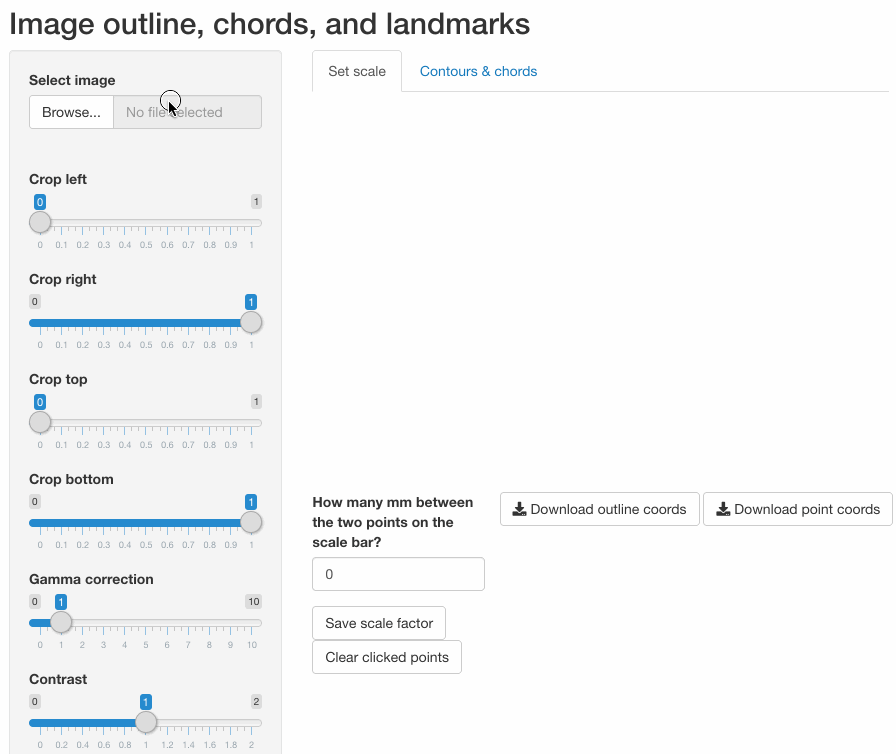

# outliner

A simple app for tracing outlines of an irregular shape and exporting the coordinates of the outline. Please install [ImageMagick](https://imagemagick.org/script/download.php) before attempting to use. 

Run the app from GitHub with `shiny::runGitHub("benmarwick/outliner")`

